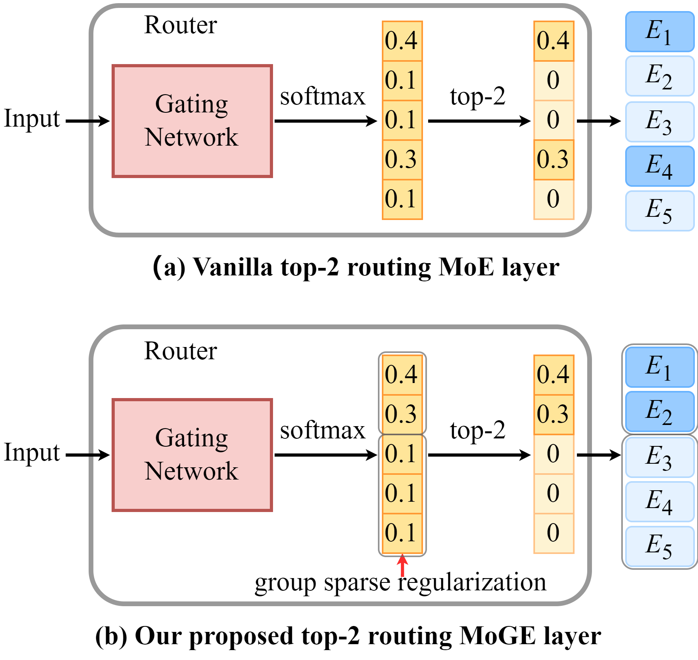

# Mixture of Group Experts

This is the implementation for the paper "**Mixture of Group Experts for Learning Invariant Representations**".

##  Introduction

**Vanilla Mixture-of-Experts (MoE)** models often exhibit **limited diversity and specialization among experts**, which constrains their performance and scalability in terms of the number of experts. In this paper, we reinterpret the combination of the most popular top-_k_ routing and experts as a form of sparse representation. Based on this foundation, we introduce **group sparse regularization** for the input of top-_k_ routing, termed the **Mixture of Group Experts (MoGE)**, to enhance expert diversity and specialization while preserving the original MoE architecture. Evaluations on various Transformer models for image classification and natural language modeling demonstrate that MoGE significantly outperforms its MoE counterpart while introducing minimal memory and computational overhead.

  
   
  <em>
    Comparison between the vanilla MoE layer and the proposed MoGE layer. (a) illustrates the vanilla MoE layer with the top-2 routing, while (b) demonstrates the application of group sparse regularization in MoGE. It is important to note that the using of group sparse regularization does not alter the MoE architecture. 
  </em>

## Usage

Path `./Image_Classification/` implements the proposed MoGE for image classification (see `./Image_Classification/README.md` for more details).

Path `./Language_Modeling/` implements the proposed MoGE for language modeling (see `./Language_Modeling/README.md` for more details).

Path `./Visual_Understanding/` implements the proposed MoGE for visual understanding (see `./Visual_Understanding/README.md` for more details).

If you just want to integrate group sparse regularization in your MoE-based models, you can import `group_sparse_regularization` from file `./group_sparse_regularization.py`. We introduce the arguments of the `group_sparse_regularization` function below.

* `scores_wo_noise`: Input of top-𝑘 routing, denoted as _z_ in the paper.
* `map_size`: A tuple representing the shape of the 2D topographic map _Z_, denoted as (r, c) in the paper.
* `filter_size`: Size of the Gaussian lowpass filter, denoted as ℎ in the paper.
* `gs_loss_weight`: Weight of the group sparse regularization, denoted as λ in the paper.
* `gs_sigma`: Sigma for generating Gaussian lowpass filter, denoted as σ in the paper.

